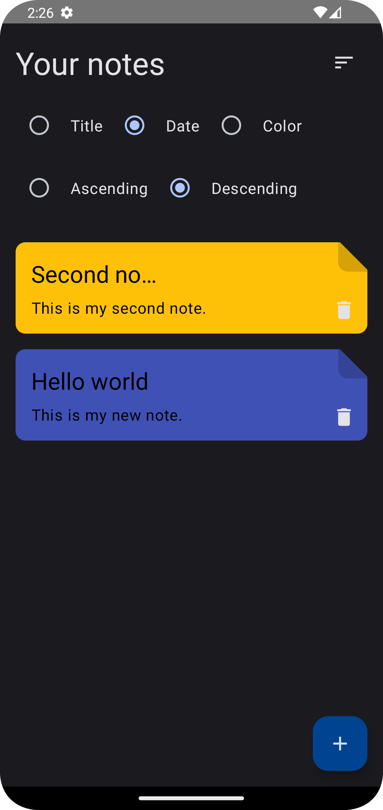
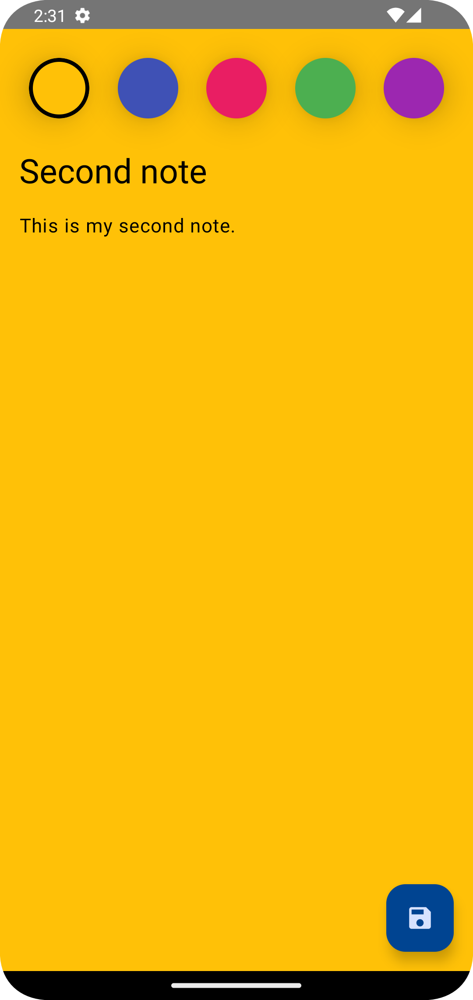

# Kote

Kote is an Android note-taking application developed using Kotlin.

## Technologies Utilized

- **Architecture**: Implemented using Clean Architecture principles
- **User Interface**: Designed using Jetpack Compose
- **Dependency Injection**: Utilized Hilt for dependency injection
- **Concurrency**: Leveraged Kotlin Coroutines and Flow for asynchronous operations
- **Database**: Employed Room for local data storage

## Key Features

- **Create, Edit, and Delete Notes**: Users can create, edit, and delete their notes with ease.
- **Sort Notes**: Sort your notes by title, date, or note color for efficient organization.

## Screenshots

| Company Listings Screen | Company Info Screen |
| ---------------------- | ------------------ |
|  |  |
